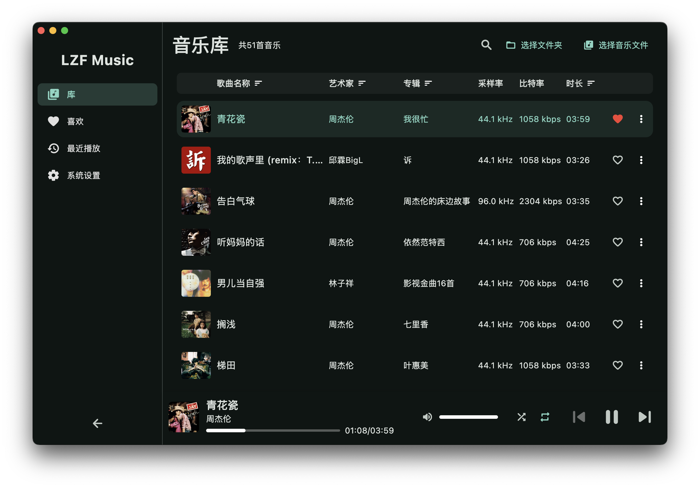
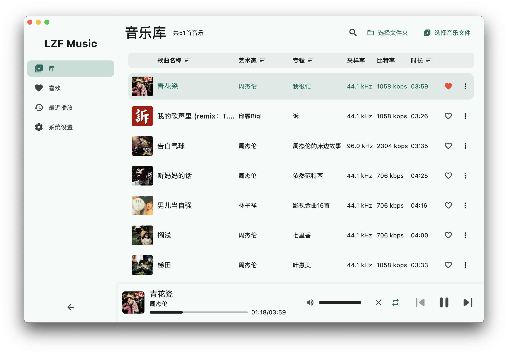
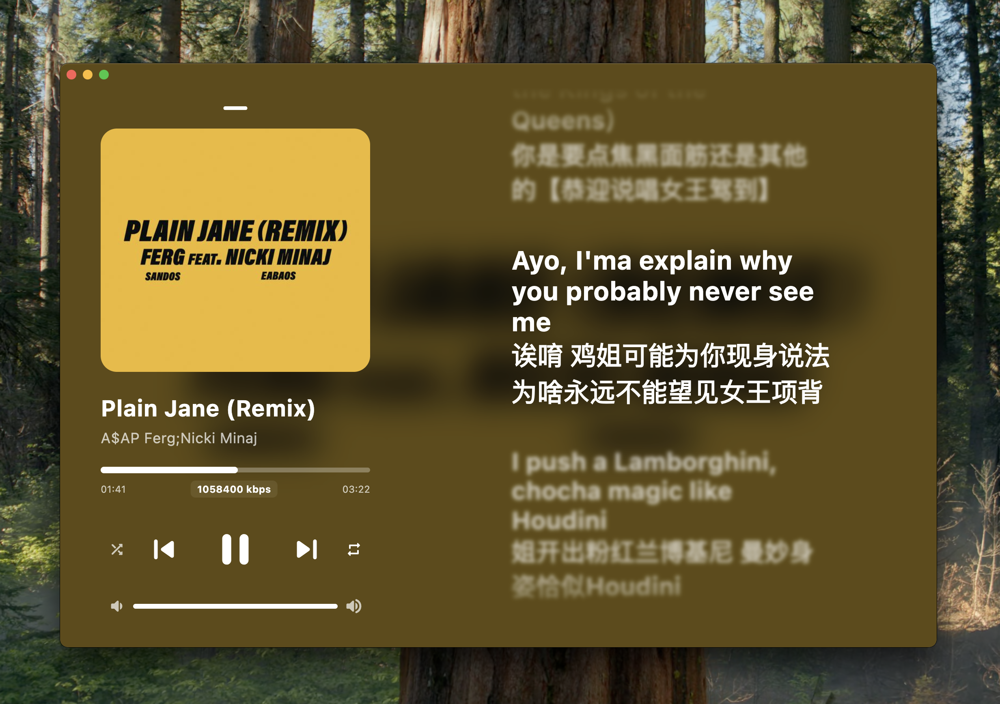

## **LZF Music - 一款优雅的 Flutter 开源音乐播放器**

**[LZF Music]** 是一款基于 Flutter 开发的开源音乐播放器，致力于为用户提供简洁、美观且功能强大的本地与私有云音乐体验。

### ✨ **核心特性**

*   **优雅设计与极致体验**：拥有媲美 Apple Music 的滚动歌词界面，设计简洁现代，为你带来沉浸式的音乐享受。
*   **广泛的音频格式支持**：全面支持 `MP3`, `M4A`, `WAV`, `AAC` 等常用格式，并完美兼容 `FLAC` 无损音频，满足你对高品质音乐的追求。
*   **智能歌词匹配**：能够自动从音乐文件中读取并展示 LRC 格式的歌词，无需手动搜索。
*   **跨平台解决方案**：得益于 Flutter 框架，未来可轻松部署在多个平台上。

### 🚀 **未来路线图 (Roadmap)**

我们正在积极开发更多令人期待的功能，包括：

*   [ ] **歌词在线搜索与编辑**：轻松找到并修正歌曲的歌词。
*   [ ] **MV 导入与播放**：将音乐与视频结合，提供更丰富的媒体体验。
*   [ ] **支持 WebDAV 协议**：连接到你的 Nextcloud、群晖 NAS 或其他个人云存储，随时随地畅听你的私有音乐库。
*   [ ] **更完善的私有云音乐解决方案**：打造真正属于你自己的音乐中心。

### 🤝 **如何贡献**

我们欢迎任何形式的贡献！无论是提交代码、报告问题还是提出新功能的建议，都对我们至关重要。请访问我们的 [GitHub 仓库](在此处插入你的 GitHub 仓库链接) 开始。

### 📜 **许可证**

本项目基于 **Apache License 2.0** 许可证开源。